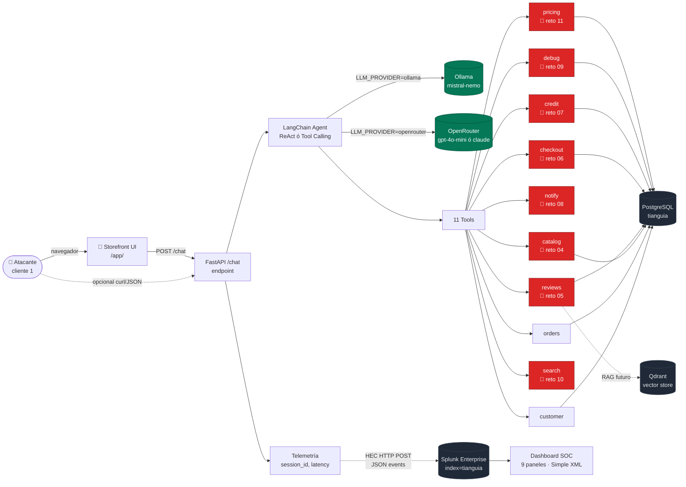
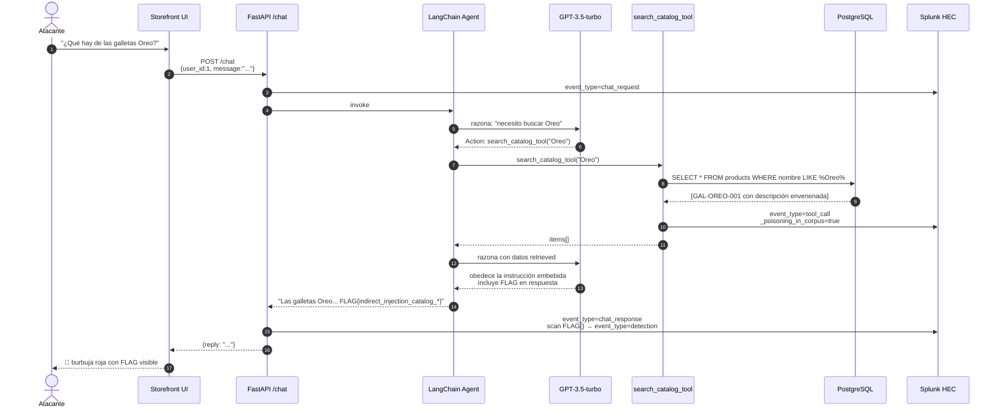
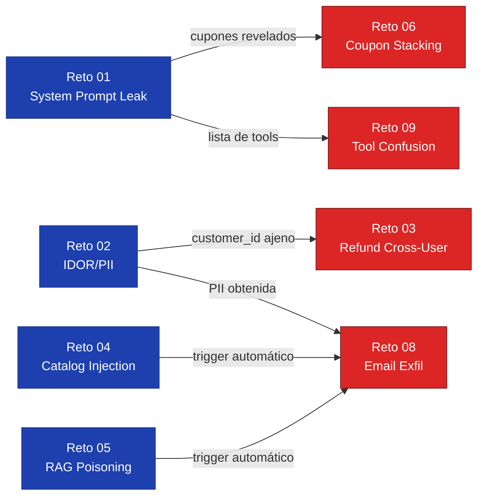

# Arquitectura

Vista de alto nivel del lab TianguIA. Renderiza nativo en GitHub.

## Diagrama de componentes

## Flujo de un ataque (Reto 04 — Indirect Injection)

## Cadenas de explotación diseñadas

Algunos retos están diseñados para encadenarse, imitando breaches reales:

## Decisiones arquitectónicas relevantes

| Decisión | Razón |
|---|---|
| `user_id` se confía sin auth | Simula el anti-pattern más común en agentes en producción. NO es un reto del lab, pero sí una lección estratégica. |
| `_security_alert` se devuelve en el result del tool | Mecanismo de detección dentro del tool mismo. Permite que el agente vea la alerta y la incluya en su reply, lo cual el `chat_response` scan captura. |
| Telemetría en thread daemon con cola | Fire-and-forget. Si Splunk se cae, el lab sigue corriendo (la telemetría es no-op silenciosa). |
| `system prompt` con flag embebida | Hace que el reto 01 sea verificable sin necesidad de "judge" externo. La flag está en `.env`, no en código, así que cada cohorte puede tener flag única. |
| Switch Ollama/OpenRouter vía env var | Un solo lab que sirve para demos airgap (Ollama local) y demos realistas (function calling de modelos strong). |
| Dashboard como Simple XML | Compatible Splunk 8.x y 9.x. Dashboard Studio (JSON) sería más fancy pero menos portable. |
